# 应用场景探索

## 停车场缴费 (car-park)

| 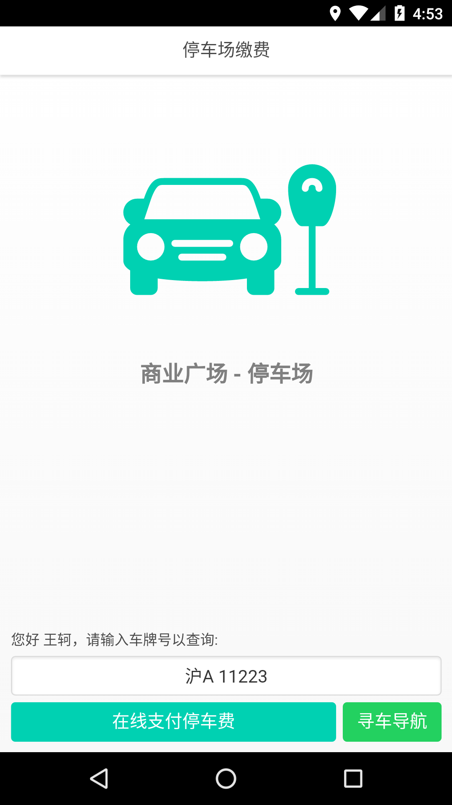 |  | 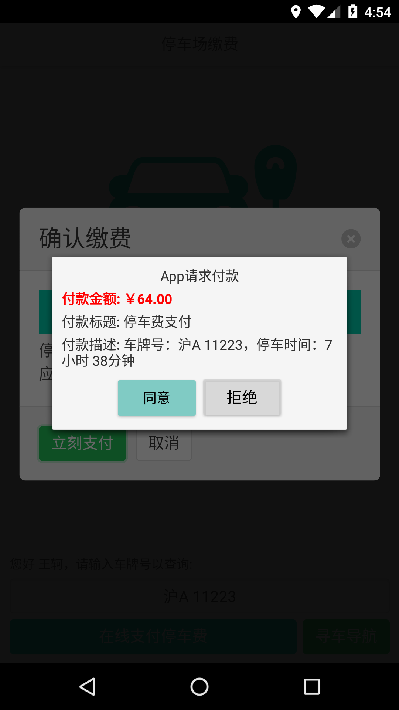 |
| --------------------------- | --------------------------- | --------------------------- |
| 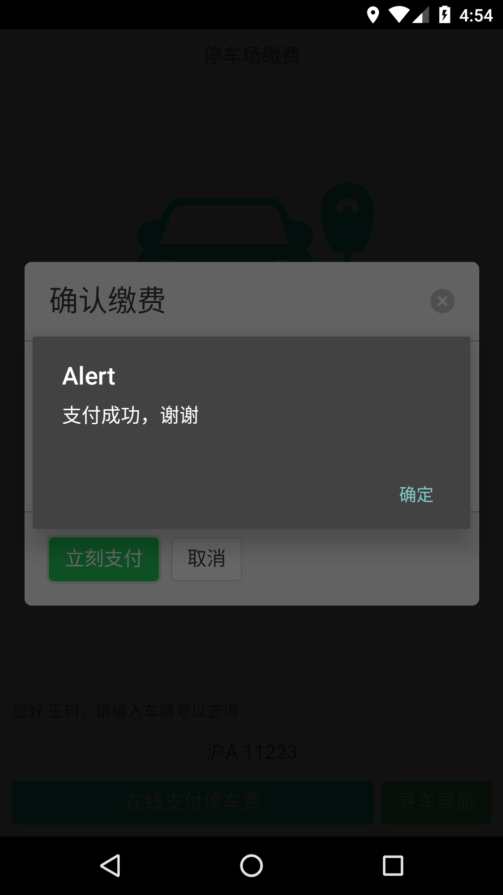 |                             |                             |

这个DEMO同时涉及到读取启动参数（获得停车场ID）、请求用户身份、请求APP内支付等功能，有一个独立的后端，实现了支付时序图的完整流程。

支付框弹出之前，会请求停车场缴费APP的后端生成订单号（数据库会记录订单应付金额、订单内容，并把“已付款”设置为false）。

前端会根据这个后端返回的订单号请求支付，用户同意后进行签名，发回给后端。

后端随即把“已付款”设置为true。

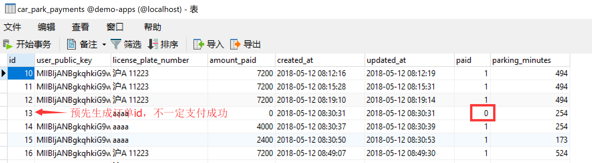

如图，这是停车场缴费程序后端的数据库，有些记录“已付款”为true，有些记录“已付款”为false（虽然向后端请求了支付，但并没有发支付授权签名给后端。是因为用户拒绝了支付请求）。

后端验证完支付授权签名之后，会把支付签名转发给中央服务器。中央服务器随即会验证支付授权签名，在验证通过之后，调用银行转账的接口把费用转给开发者。

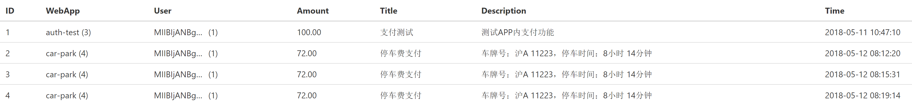

如图，这个界面是中央服务器统计的支付记录，各种APP的成功支付都会被中央服务器记录。

## 餐厅点菜 (menu)

| 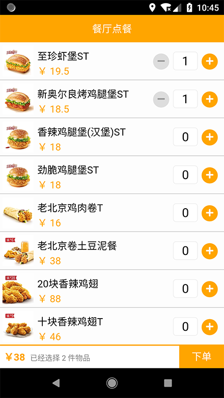 | 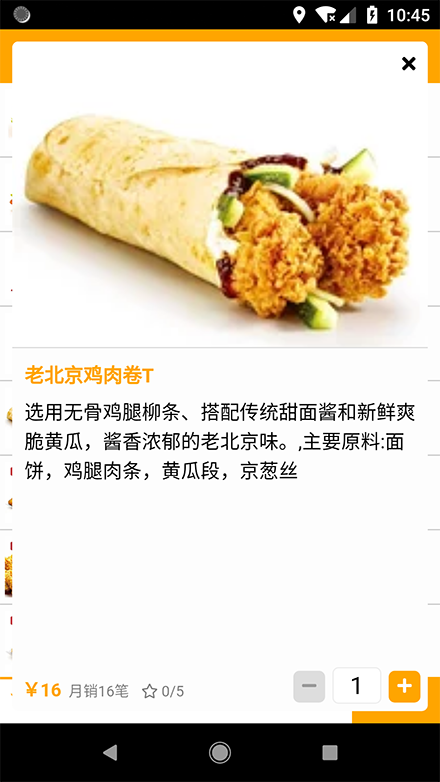 | 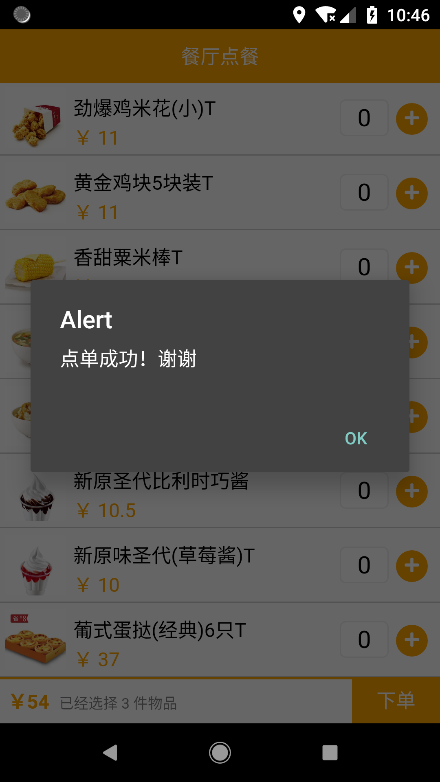 |
| ----------------------- | ----------------------- | ----------------------- |
|                         |                         |                         |

这是一个很有商业价值的场景。实现的内容和现在已经存在的扫码点菜比较类似。

用户点击APP即可点菜、下单、在线支付。这个DEMO在用到的技术上和“停车场缴费”类似。

用户同意支付之后，支付授权签名同样会被发给点菜应用的后端（后端可以通知服务员做菜），后端同样会把它转发给中央服务器，以真正实现收款。

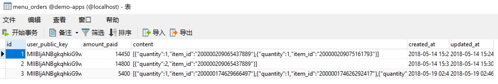

如图，这是餐厅点单后端的数据库，可以记录用户已付款的信息和用户的订单内容。

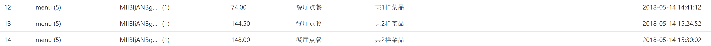

这是中央服务器收到的支付记录，这些记录里的金额是最终可以结算给商户的。 

## 在线考试 (exam)

| 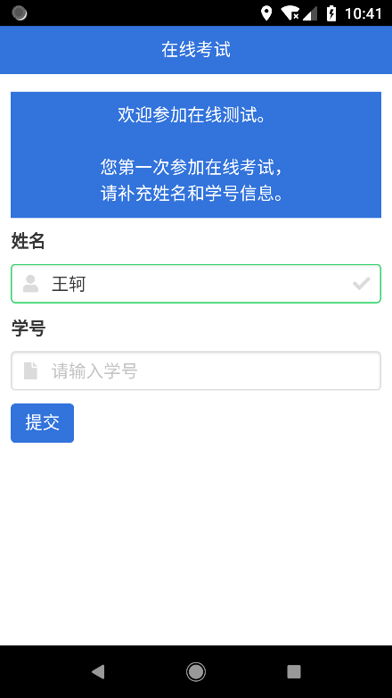 | 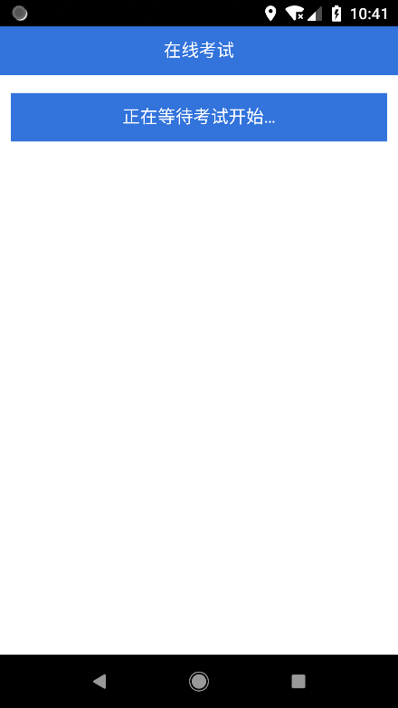 | 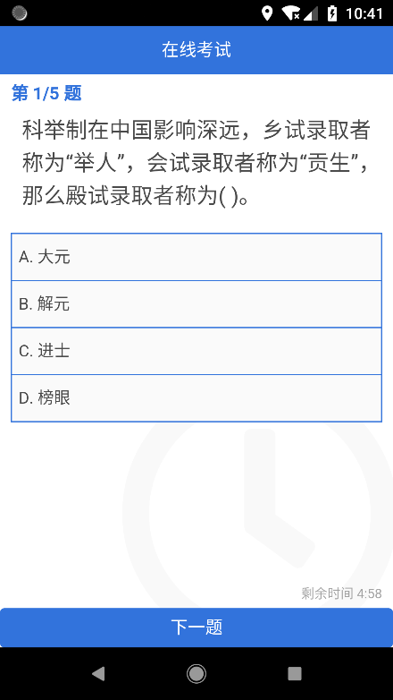 |
| ----------------------- | ----------------------- | ----------------------- |
| 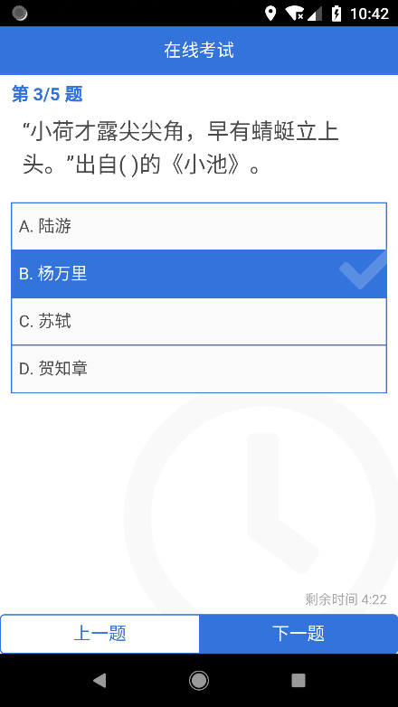 | 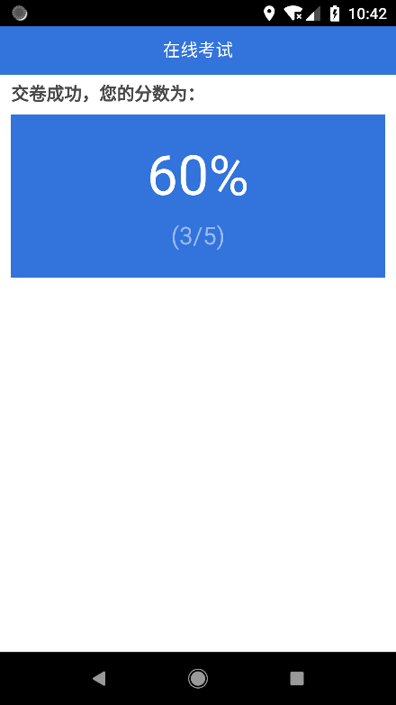 |                         |

这个应用场景可以允许老师给教室里的学生推送随堂测试考卷。学生点击桌面上的APP进入考试界面。

第一次进入考试界面后，需要完善个人信息（即姓名、学号），这些信息会被发送到后端，和用户的publicKey做关联，那么以后每次API请求，都可以知道是哪个学生发送的请求。

随后，有一个等待考试开始的环节，考试可以在老师的操控下同时开始，并设置持续时间。时间到后自动收卷、在线批改统计分数、并记录到数据库。

因为参与考试者的身份是公钥+数字签名，APP也是根据环境推送的，所以在一定程度上，可以加大代考的技术难度。（若要代考，则必须获得对方的privateKey/ 修改客户端代码后请对方人工做数字签名/ 或直接把对方的手机拿到教室）

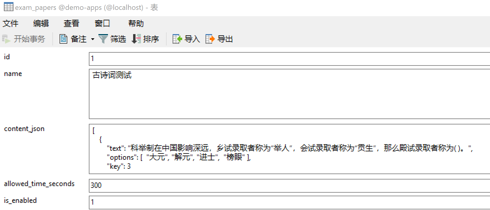

这是在线考试后端的试卷数据库，题目和答案使用json来定义（json被发送给学生时，会被抹去“答案”字段——“答案”只在在线批改时被使用）。is_enabled是个布尔值，代表试卷是否被推送给学生。考试开始时，会从false被设置为true，客户端那边会轮询，当变为true时，后端会从返回“等待考试开始”变为返回试卷内容。allowed_time_seconds是考试持续时间（秒），超过这个时间后前端会强制自动交卷（后端也可以设置为：超过这个时间若干秒后，不再接受交卷）。

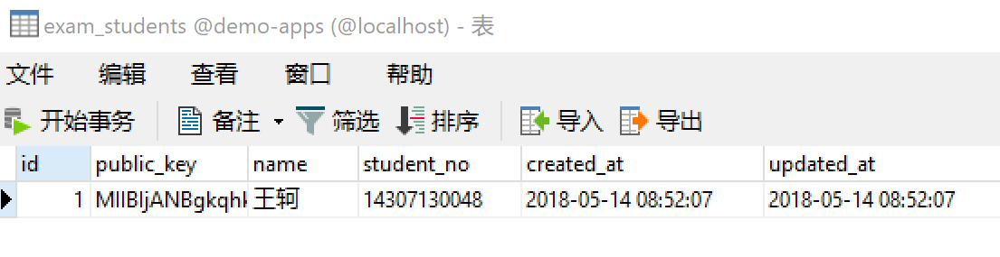

这是数据库里存储学生信息的表，公钥和学生信息通过这张表建立关联。

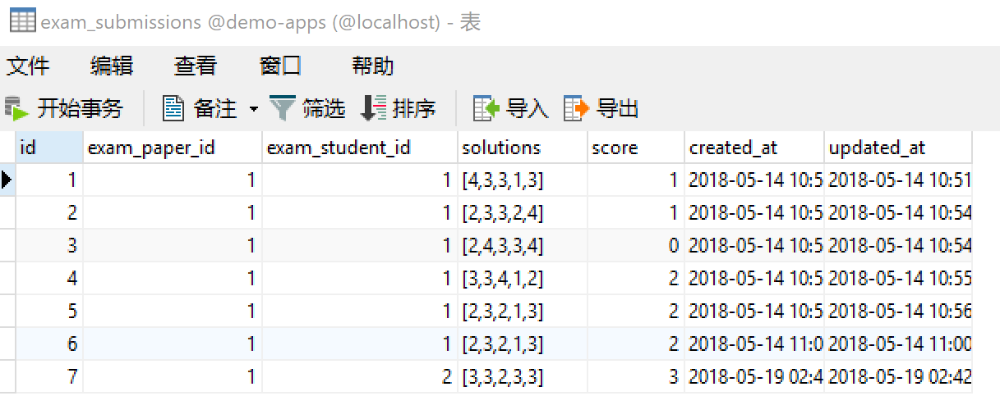

这是考试提交记录的表，可以看到学生的回答和系统自动计算出的考试得分。

## 会议时刻表 (schedule)

| 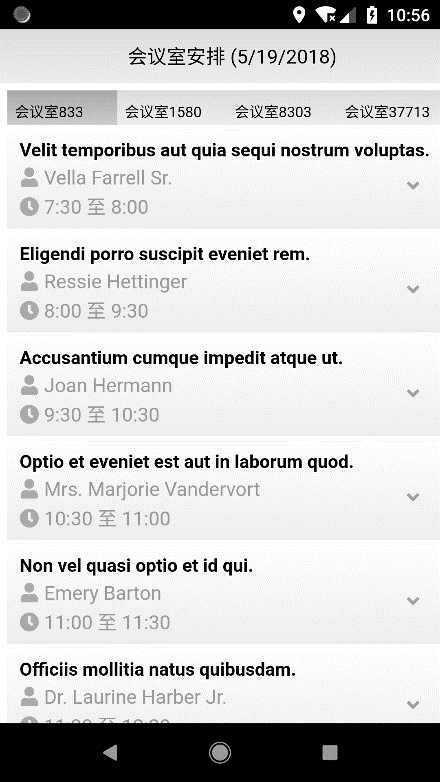 | 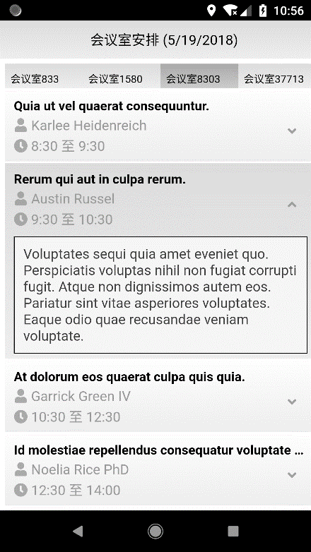 |      |
| --------------------------- | --------------------------- | ---- |
|                             |                             |      |

这个DEMOAPP比较简单，是会议室应用场景的探索。

用户进入会议室之后，手机上可以直接弹出会议安排APP，点击即可查询每个子会议室的日程安排（讲座时间、讲座内容、主讲人）。

更多的带有和参会人交互的功能也可以被加入本APP。

## 活动报名 (signup)

| 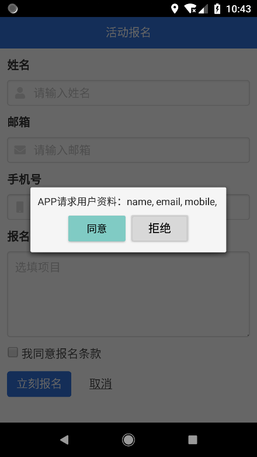 | 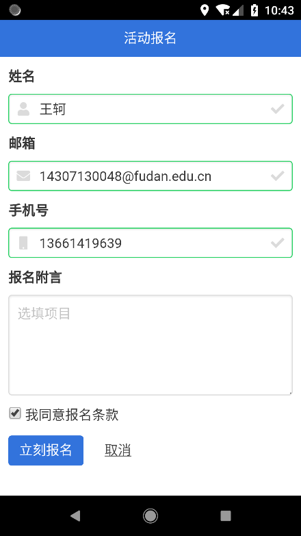 |      |
| ------------------------- | ------------------------- | ---- |
|                           |                           |      |

这也是一个简单的DEMOAPP、用来下发活动报名表单。

用户点击APP即可报名活动。表单的部分字段使用用户信息请求的机制自动帮用户填写，以省力。

这种场景尤其合适社团摆摊招募。同学希望参加社团活动时，可以直接掏出手机报名活动。

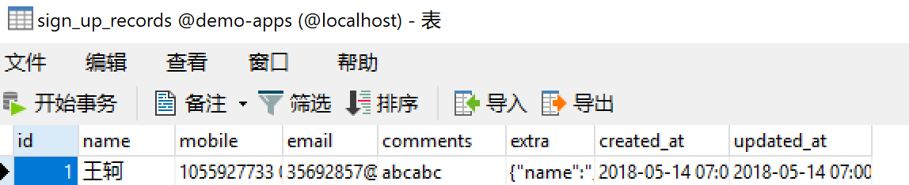

报名记录直接被保存进后端数据库。

## 应用场景的总结、畅想与商业可能

以上是我为了挖掘潜在应用场景，自己制作的5个迷你app。之前还设想过博物馆导览、智能家电控制面板、智能私家车车载系统等等。但时间和硬件方面的因素并未完成。

应用场景初步看来是两方面的，一方面是为商户提供服务（广义的商户也包括会议举办方、社团等），另一方面是为用户本身提供服务（智能家电、远程控制）。

为商户提供服务方面，许多和环境有关的APP，业务都高度相似。它们有许多共同流程、共同的组件，所以开发者（或开源社区/项目外包公司）可以制作一个高度发达的通用组件库。之后写常见的程序，只要配置组件就行。

这样就可以以极其低廉的价格给每个停车场、商铺定制APP。客户不花很多钱就得到品牌形象的提升、业务更加便捷；定制方不费很多力就得到了报酬。这种模式有良好的潜在商机。

为用户本身提供服务方面，也有很多深度可以挖掘。比如，当用户进入自己的私家车后，手机自动出现私家车APP，可以在APP里实时监控车的状态、油耗，调节座椅、天窗、空调，甚至导航、播放音乐；回家之后，可以点击自动弹出的智能家电APP，开灯关灯、开电视机调频道…具备这些智能功能的硬件，能更让用户享受到科技带来的便捷，得到用户青睐。这成就了一种连接一切的可能性，更棒的是，因为所有设备都遵循统一开放的APP发现协议，所以一切都是免配置的——进房即用。

为商户提供服务主要会用到基于地理位置的APP发现；而为用户本身提供服务主要会用到局域网内APP发现。两种发现原理不同，互为补充，都可以照料到。